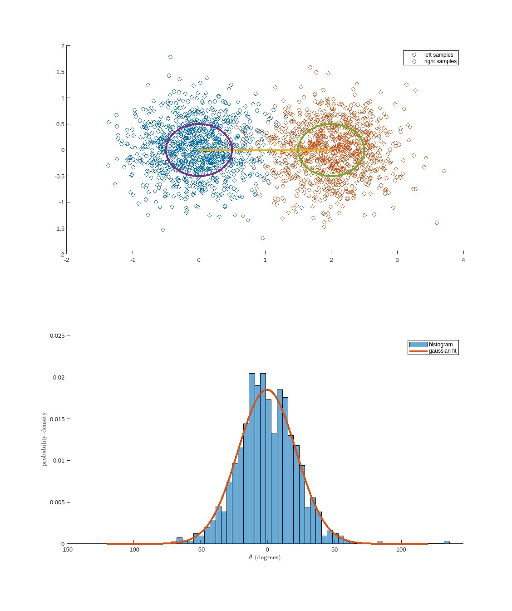
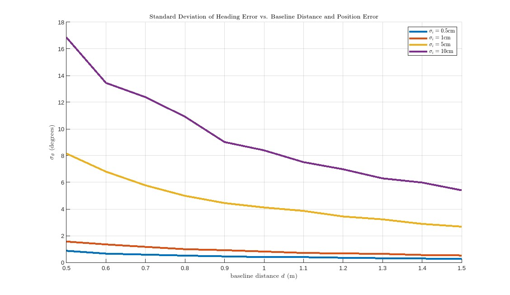

# Monte-Carlo Simulation for RTK Heading
To estimate the relationship between individual receiver noise, baseline distance between receivers, and heading estimate noise, we can perform a Monte-Carlo simulation.

## System Model
We can start by modeling the left and right position estimates $p_l, p_r$ as 2D Gaussian random variables, centered at either end of the baseline with length $d$. Both variables have the same distribution, with equal variance $\sigma_i^2$ in both dimensions:

$$
\begin{align*}
    p_l &\sim \mathcal{N}\left(\begin{bmatrix} 0 \\ 0 \end{bmatrix}, \Sigma\right) \\
    p_r &\sim \mathcal{N}\left(\begin{bmatrix} d \\ 0 \end{bmatrix}, \Sigma\right) \\
    \Sigma &= \begin{bmatrix} \sigma_i^2 & 0 \\ 0 & \sigma_i^2 \end{bmatrix} \\
\end{align*}
$$

We can then compute the heading estimate $\tilde{\theta}$ as the angle between the baseline and the x-axis, and compare it to our true heading $\theta$ to compute the heading estimate error. Note that we want to compute the **signed** heading estimate error, so we need to take into account the sign of the y-component of the baseline vector:

$$
\begin{align*}
    v &= p_r - p_l, \ \hat{v} = \frac{v}{\|v\|} \\
    |\tilde{\theta}| &= \arccos\left(\hat{v} \cdot \begin{bmatrix} 1 \\ 0 \end{bmatrix}\right) = \arccos(\hat{v}_x) \\
    \tilde{\theta} &= \arccos(\hat{v}_x) \cdot \text{sign}(\hat{v}_y) = \arccos(\hat{v}_x) \frac{\hat{v}_y}{|\hat{v}_y|} \\
    \theta_e &= \tilde{\theta} - \theta \\
    &= \tilde{\theta} - 0 = \tilde{\theta}
\end{align*}
$$

Therefore the heading estimate error is $\tilde{\theta}$, which we have now expressed in terms of the baseline length $d$ and the individual receiver noise $\sigma_i^2$.

## Monte-Carlo Simulation
To estimate this heading error, we can perform a Monte-Carlo simulation. We can draw a large number of samples from the distributions of $p_l$ and $p_r$, compute the heading estimate error for each sample, and then use all of the heading error samples to estimate mean and variance. Here are the results of a simulation with 1000 samples, $\sigma_i = 0.5$ m, and $d = 2$ m:

In this simulation, the mean heading error was -0.3316 degrees, and the standard deviation was 21.5534 degrees.

In order to estimate the relationship between heading error, baseline length, and individual receiver noise, we can perform this simulation repeatedly over a range of baseline lengths and individual receiver noise values. Here are the results:

Based on these results, we can assume that a baseline distance of less than 1m will probably be adequate given that we achieve a reasonable RTK position error of a few centimeters, since single digit degree inaccuracies are unlikely to significantly harm our navigation performance.

These results assume a simple model with Gaussian noise, which likely does not accurately reflect the noise characteristics of a real world RTK system. However, this model is sufficient to give us a rough idea of the relationship between baseline length, individual receiver noise, and heading estimate error.